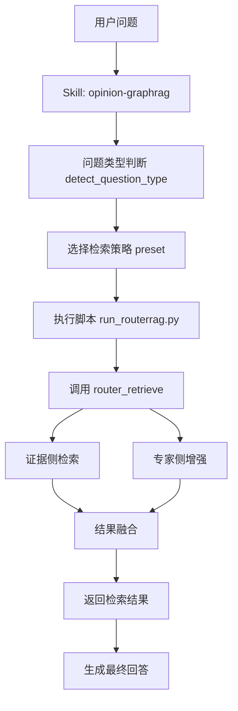
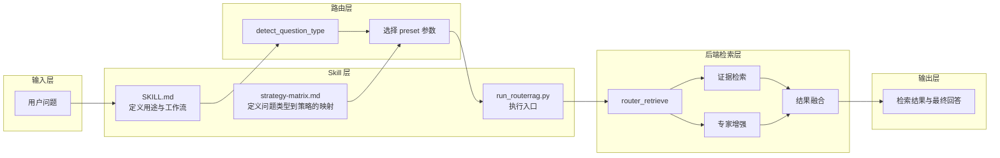
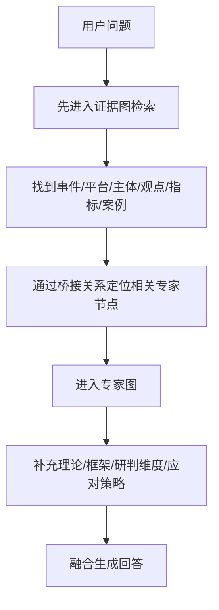
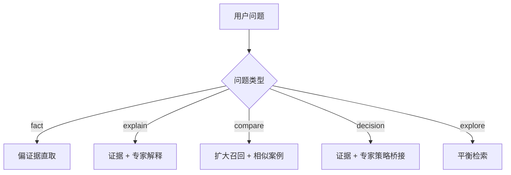

# 舆情 GraphRAG Skill 调用链说明 v1

本文档用于说明：当用户提出一个问题后，`opinion-graphrag` skill 如何把问题路由到当前系统的 RouterRAG 检索链路，并在证据图与专家图之间完成协同。

## 1. 总体流程图

## 2. 新手版理解

可以把这条链路理解成 5 步：

1. 用户先提出问题。
2. skill 先判断这个问题属于哪一类。
3. 系统按问题类别，自动选择一套检索参数。
4. 参数传给当前真实后端入口 `router_retrieve(...)`。
5. 后端先取证据，再补专家视角，最后整理成答案。

## 3. 分层流程图

## 4. 每一层分别在干什么

### 4.1 输入层

用户只需要提一个自然语言问题，比如：

- 这次事件为什么会发酵？
- 主要在哪些平台传播？
- 和过去哪些事件相似？
- 下一步应该怎么回应？

### 4.2 Skill 层

这一层不是业务引擎，而是“使用说明 + 调度工具”。

各文件作用如下：

- `SKILL.md`
  负责定义这个 skill 是干什么的，以及什么时候应该启用它。
- `strategy-matrix.md`
  负责定义不同问题类型对应什么检索策略。
- `run_routerrag.py`
  负责真正执行：判断问题类型，装配参数，调用后端。

### 4.3 路由层

这一层负责先判断“这是什么问题”，再决定“怎么检索”。

当前问题类型分为 5 类：

- `fact`
  事实型，问的是什么、多少、谁、哪里。
- `explain`
  解释型，问的是为什么、原因、机制。
- `compare`
  对比型，问的是类似案例、异同、历史比较。
- `decision`
  决策型，问的是怎么办、如何回应、下一步策略。
- `explore`
  探索型，问题较宽泛，先做开放式摸底。

### 4.4 后端检索层

真正干活的是当前后端的 `router_retrieve(...)`。

它不是单纯去一个地方查，而是把多个检索来源做组合。

这里最重要的原则是：

**证据优先，专家增强第二步。**

意思是：

- 先去抓和问题直接相关的事实、案例、帖子、事件、指标、结论
- 再根据问题类型，决定要不要引入专家图谱中的概念框架、解释模型、策略建议

### 4.5 输出层

最后输出的不是一个单纯文本块，而是“整理过的检索结果”。

在理想状态下，它会包含两部分：

- 证据依据
- 专家增强后的解释或策略组织

## 5. 双图谱在这条链里怎么联动

这条链路的核心不是“两张图同时乱搜”，而是分阶段协作：

1. 先在证据图里找到和当前问题直接相关的对象。
2. 再通过桥接关系，去专家图里找解释框架或策略资源。
3. 最后把两边结果融合起来。

这样做的好处是：

- 不会一开始就被抽象理论带偏。
- 能保证回答先有事实支撑。
- 在解释型和决策型问题里，又能拿到更强的“讲故事能力”。

## 6. 不同问题类型如何触发不同检索路径

可以这样理解：

- `fact`
  优先回答“是什么”，所以更重证据检索。
- `explain`
  优先回答“为什么”，所以需要证据加解释框架。
- `compare`
  优先回答“像不像、差在哪”，所以要更广召回相似案例。
- `decision`
  优先回答“怎么办”，所以更需要专家图提供应对策略。
- `explore`
  问题不够明确时，先做均衡摸底。

## 7. 用一句话总结整套链路

这套 skill 的本质不是重新实现 GraphRAG，而是把当前系统的检索过程标准化为：

**先识别问题类型，再选检索策略；先抓证据，再补专家；最后融合成可回答的结果。**

## 8. 对你后续改造最有帮助的点

如果你后面要继续升级这套系统，这份调用链图最关键的价值在于把职责拆清楚了：

- skill 负责“怎么用系统”
- RouterRAG 负责“怎么组合检索”
- 证据图负责“提供事实依据”
- 专家图负责“提供解释框架和策略增强”

后面不管你是扩节点、加桥接关系，还是做更细的问题分类，本质上都是在优化这 4 层协同。
